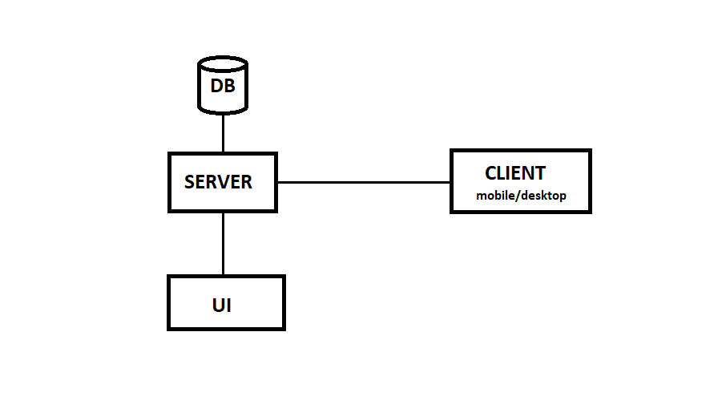

# Distributed social media/blogging application

### Description
A distributed social media/blogging application

  
<b>Timeline</b>

1. intro & install tools
2. server (java spring)
3. free session
4. mobile (android)/desktop app (C#)
5. frontend (vue)
6. free session
7. final presentation

 

  
<b>Key Concepts</b>

- [java, jdk](https://www.scaler.com/topics/java/how-java-program-works/)
- [java Spring, dependency injection](https://docs.spring.io/spring-framework/docs/3.2.x/spring-framework-reference/html/overview.html)

- [API](https://www.postman.com/what-is-an-api/), [API endpoint](https://blog.postman.com/what-is-an-api-endpoint/), [Postman](https://www.geeksforgeeks.org/introduction-postman-api-development/)
- [JSON](https://www.w3schools.com/whatis/whatis_json.asp)
- [HTTP](https://www.geeksforgeeks.org/what-is-http/)
- [Rest](https://www.geeksforgeeks.org/rest-api-introduction/)
- [Get, Post, Put/Patch, Delete](https://restfulapi.net/http-methods/)

- [SQL](https://www.w3schools.com/sql/sql_intro.asp) / [CRUD operations](https://www.freecodecamp.org/news/crud-operations-explained/)
- [ORM](https://www.baeldung.com/cs/object-relational-mapping), [JDBC, JPA] (https://www.baeldung.com/jpa-vs-jdbc), Hibernate, SpringDataJPA

- optional: [Docker](https://www.simplilearn.com/tutorials/docker-tutorial/getting-started-with-docker)

 

  
<b>Tools</b>

Install following tools:

- [Git client](https://git-scm.com/downloads/win), [setup credentials locally](https://www.geeksforgeeks.org/how-to-set-git-username-and-password-in-gitbash/)
- [jdk](https://www.oracle.com/java/technologies/downloads), [mvn](https://maven.apache.org/download.cgi), [Intellij community edition](https://www.jetbrains.com/idea/download)
- [Postman](https://www.postman.com/downloads/)
- [Mysql installer](https://dev.mysql.com/downloads/installer/): install Mysql workbench, Mysql server, jdbc(JConnector)
- spring project initializer: https://start.spring.io/
- optional: [Docker](https://spring.io/guides/gs/spring-boot-docker)

Check installation in cmd:
- `git --version`
- `java --version`
- `mvn --version`

Other tools and libraries:
- spring project initializer: https://start.spring.io/
- [lombok](https://www.baeldung.com/intro-to-project-lombok)
- optional: [Docker](https://spring.io/guides/gs/spring-boot-docker)

### Project requirements
- Database:
  - User: id, name, email
  - Post: id, title, content, user_id, created_on, status (status poate fi PENDING, PUBLISHED, REMOVED)
  - Comment: id, post_id, content, user_id, created_on
- Server:
  - 8 endpoint-uri pentru operatiile CRUD pe Post si Comment + `createUser()`
  - 2 endpoint-uri cu custom query pentru `getAllPublishedPostsForUser()` si `getAllCommentsForPost`()
- Frontend:
  - sa permita operatii de tipul: create new post (pending), view posts and comments, view pending posts, add/update comment, remove post, etc. Minim 6 operatii.
  - minim 4 componente Vue
- Desktop client:
  - sa permita minim 3 operatii: get all posts/comments containing keyword, approve/remove post, sendEmail to all selected persons (functionalitatea de sendEmail este inca un endpoint din server, se implementeaza usor cu SMTP, exista cod pe net)
- Documentatie:
  - diagrama use-case
  - diagrama secventiala pentru un caz de utilizare
  - **nimic tiparit!**

### Other notes
- Proiectul trebuie sa fie consistent (utilizare posibila fara alterarea manuala a bazei de date: ex: `getPublishedPosts()` nu are sens fara `approvePost()`)
- 1p in plus pentru prezentarea inainte de vacanta